<h1 align="center">✨ PixelSense AI: U-Net for Semantic Image Segmentation ✨</h1>

<p align="center">
  A robust, interactive web application for real-time semantic image segmentation, powered by a U-Net model meticulously trained from scratch using TensorFlow/Keras.
</p>

<p align="center">
  
</p>

<p align="center">
  <a href="https://pixelsense-ai-segmentation-n9srxvnie8tcsusmr2eq3x.streamlit.app/" target="_blank">
    
  </a>
  
  
  
</p>

---

## 💡 Overview

This project presents **PixelSense AI**, an interactive web application that performs **semantic image segmentation** using a custom-built **U-Net Convolutional Neural Network**. Unlike many segmentation projects that rely on pre-trained models, this U-Net was meticulously **trained from the ground up on a diverse dataset**, demonstrating a deep understanding of model architecture, training methodologies, and deployment strategies.

The application allows users to either upload their own images or select from a curated set of examples to see real-time pixel-level classification, making it a powerful tool for visualizing the capabilities of deep learning in computer vision.

---

## 🚀 Live Demo

Experience PixelSense AI in action!
Click the badge below to access the deployed Streamlit application:

[](https://pixelsense-ai-segmentation-n9srxvnie8tcsusmr2eq3x.streamlit.app/)

---

## ✨ Features

* **Custom U-Net Model:** A U-Net architecture designed and trained from scratch for semantic segmentation.
* **Interactive Web Interface:** Built with Streamlit for a user-friendly experience.
* **Image Upload:** Segment your own images (JPG, JPEG, PNG, WEBP).
* **Example Image Selection:** Choose from 20 random images from the dataset for quick demonstrations.
* **Real-time Segmentation:** See immediate results of the U-Net's predictions.
* **Visual Comparison:** Side-by-side display of original and segmented images.
* **Detailed Explanations:** Learn about the U-Net architecture and the app's workflow directly within the interface.

---

## 🧠 Technical Deep Dive: Demystifying the U-Net

The core of PixelSense AI is a **U-Net**, a powerful Convolutional Neural Network (CNN) architecture specifically designed for semantic segmentation. It excels at understanding image content at a pixel level, assigning a specific category (e.g., "road," "car," "sky") to every pixel.

<p align="center">
  
  <br>
  <em>U-Net Architecture Overview</em>
</p>

The U-Net gets its name from its 'U' shaped architecture, which is divided into two main paths:

### 1. Encoder (The Contracting Path - Left Side of 'U')

This path is responsible for capturing context and extracting high-level features. It's like the model "squinting" at the image, progressively reducing its spatial dimensions while increasing the number of feature channels.

<p align="center">
  
  <br>
  <em>The U-Net Encoder up close</em>
</p>

Each block in the encoder typically involves:
* Two $3 \times 3$ `Conv2D` layers, followed by a `ReLU` activation function. These layers learn to detect patterns and features. Our model uses `kernel_initializer='he_normal'` for robust weight initialization.
* `Dropout` layers (used in deeper blocks, with $0.3$ probability) to prevent overfitting and enhance generalization.
* A `MaxPooling2D` layer, which acts like "zooming out" by taking the maximum value in small regions, effectively halving the spatial dimensions (e.g., from $H \times W$ to $H/2 \times W/2$). This reduces computational load and helps capture larger-scale features.

### 2. Decoder (The Expanding Path - Right Side of 'U')

The decoder path is responsible for precise localization. It "un-squints" and reconstructs the image, restoring spatial detail and precise segmentation outlines.

<p align="center">
  
  <br>
  <em>The U-Net Decoder up close</em>
</p>

This path uses:
* `Conv2DTranspose` layers (also known as "deconvolution" or "upsampling convolution") to effectively "stretch" the feature maps, doubling their spatial dimensions (e.g., from $H/2 \times W/2$ to $H \times W$).
* Following the upsampling, it applies two more $3 \times 3$ `Conv2D` layers with `ReLU` activation to refine the features at the new resolution.

### 3. Skip Connections (The Bridges of the 'U')

This is the magic of the U-Net! These connections directly link feature maps from the encoder to the corresponding upsampled feature maps in the decoder. When the encoder compresses the image, it loses some fine-grained spatial information (like exact edges). The skip connections act like "bridges," bringing back these high-resolution, low-level features directly to the decoder. By concatenating (`concatenate` layer) these features, the decoder can combine both the "what" (semantic information from deep layers) and the "where" (spatial information from shallow layers) to produce very precise and detailed segmentation masks.

---

## 📊 Model Training & Evaluation

The U-Net model was trained from scratch on a custom dataset of images and their corresponding segmentation masks. The training process involved:

* **Dataset:** Images from `data/CameraRGB/` and masks from `data/CameraMask/`.
* **Input Size:** Images are resized to $96 \times 128 \times 3$ pixels.
* **Number of Classes:** 23 distinct segmentation classes.
* **Loss Function:** `SparseCategoricalCrossentropy(from_logits=True)`.
* **Optimizer:** `tf.keras.optimizers.Adam()`.
* **Metrics:** `sparse_categorical_accuracy` and a custom `MeanIoU` metric (`CustomMeanIoU`).
* **Callbacks:** `ModelCheckpoint` to save the best model based on `val_mean_iou`, and `EarlyStopping` to prevent overfitting.

### Training Progress

The model was trained over multiple phases, with a total of approximately 70 epochs, incorporating early stopping and model checkpointing.

<p align="center">
  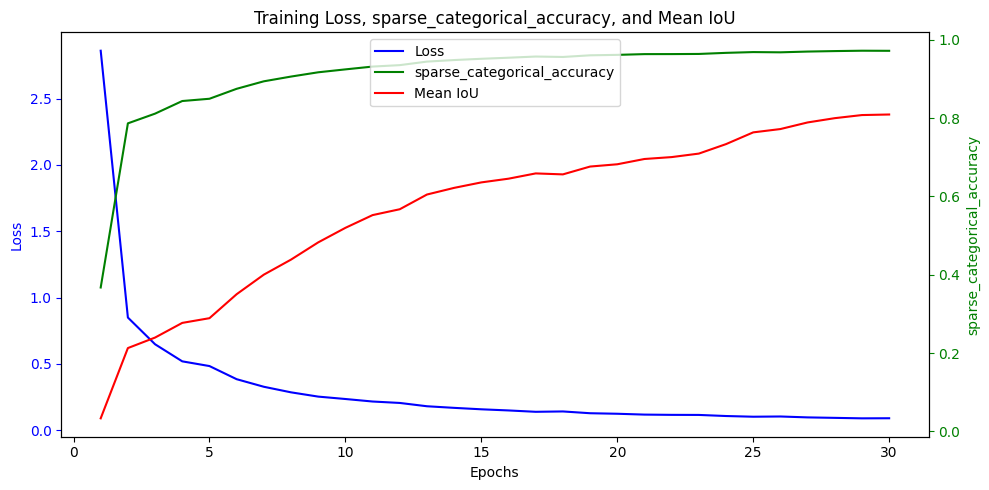
  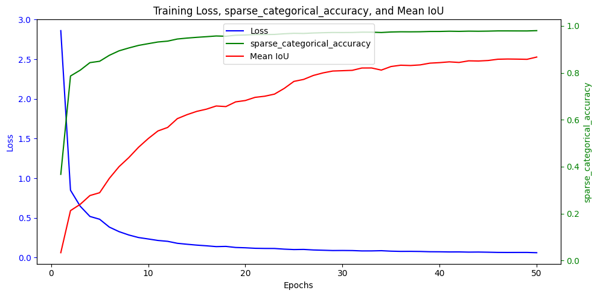
  <br>
  <em>Training Loss, Accuracy, and Mean IoU over initial epochs.</em>
</p>
<p align="center">
  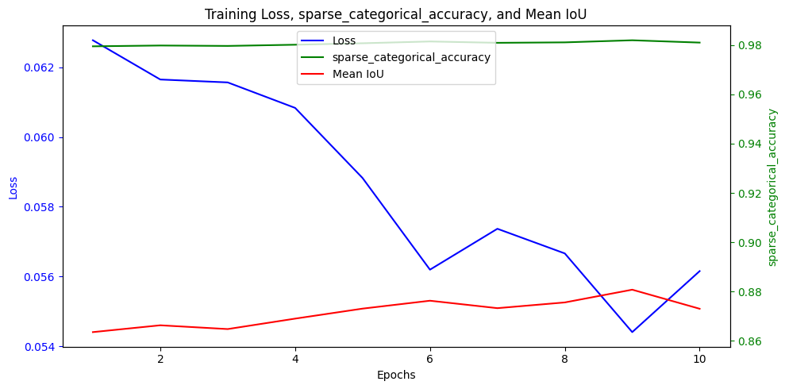
  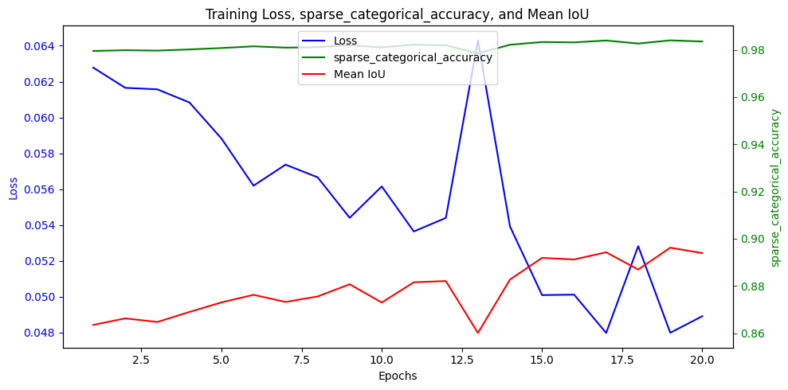
  <br>
  <em>Training Loss, Accuracy, and Mean IoU over later epochs.</em>
</p>
<p align="center">
  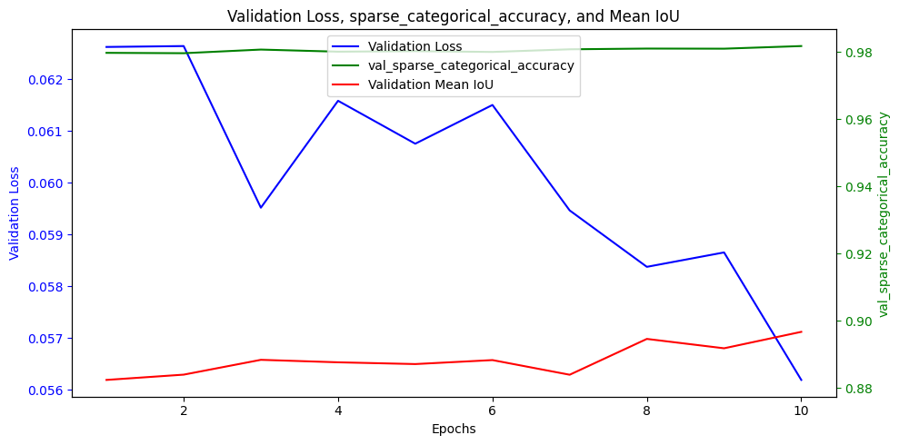
  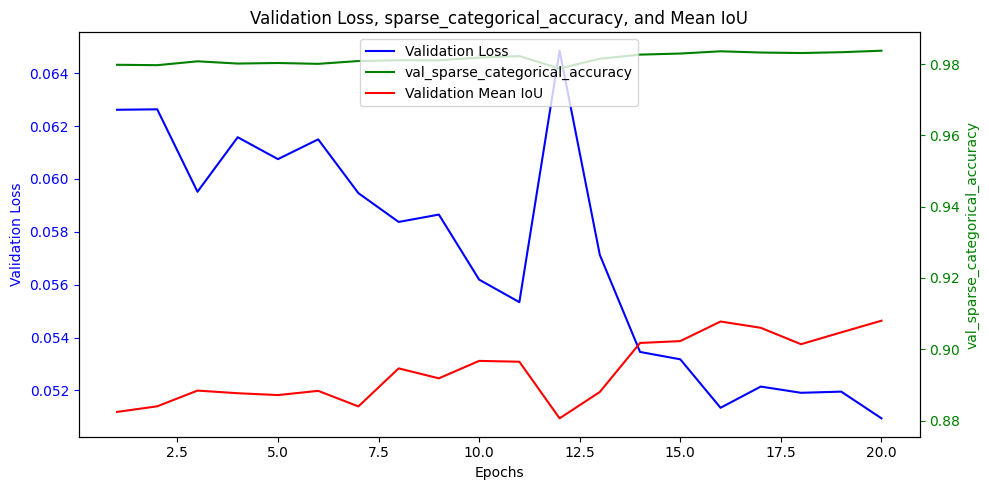
  <br>
  <em>Validation Loss, Accuracy, and Mean IoU over later epochs.</em>
</p>

### Final Evaluation Metrics (on Training and Validation Data)

The `best_unet_model.h5` (or `model_weights.h5` which is saved from the best model) represents the state with the highest validation Mean IoU.

* **Train Loss:** (e.g., `0.0468`)
* **Train Accuracy:** (e.g., `0.9842`)
* **Train Mean IoU:** (e.g., `0.8967`)
* **Val Loss:** (e.g., `0.0509`)
* **Val Accuracy:** (e.g., `0.9837`)
* **Val Mean IoU:** (e.g., `0.9080`)

---

## 🖼️ Segmentation Results

Here are some examples of images processed by the PixelSense AI, showcasing the U-Net's ability to accurately segment various objects.

<p align="center">
  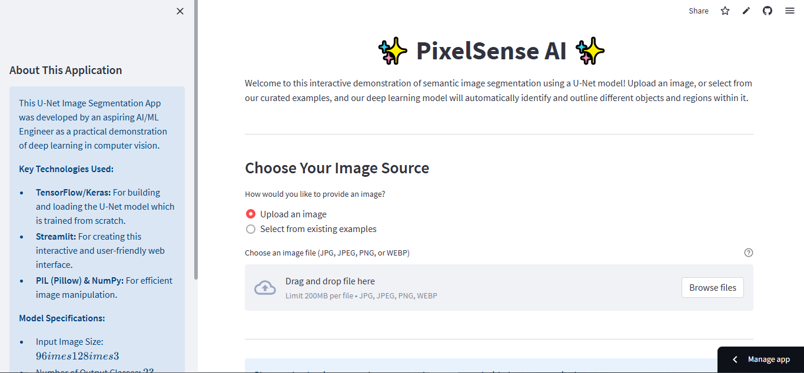
  <br>
  <em>PixelSense AI Application Home Screen</em>
</p>

<p align="center">
  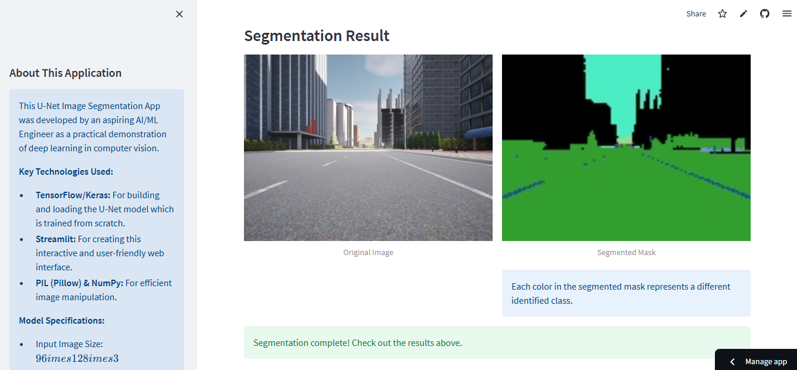
  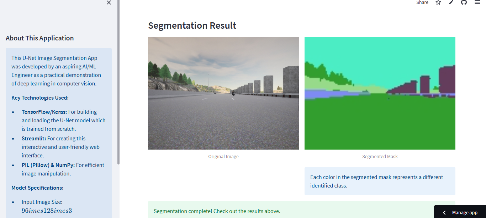
  <br>
  <em>Example Segmentation Results (Original vs. Mask)</em>
</p>
<p align="center">
  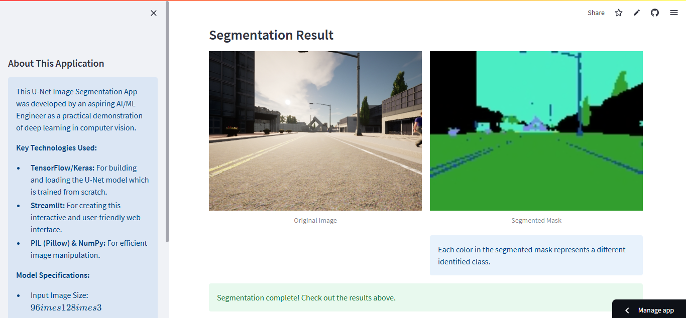
  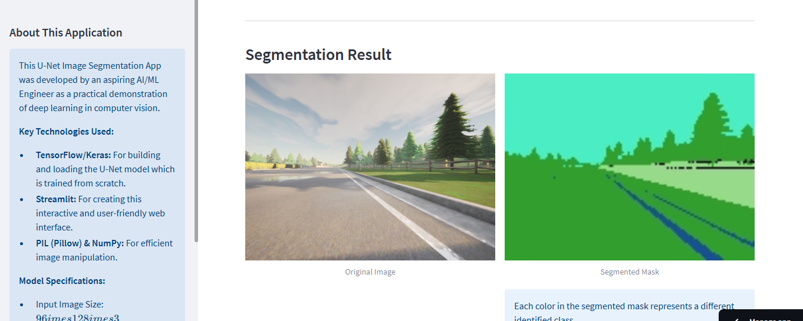
  <br>
  <em>More Example Segmentation Results</em>
</p>

---

## 🛠️ Getting Started (Local Setup)

To run this project locally, follow these steps:

### Prerequisites

* Python 3.9+
* Git

### 1. Clone the Repository

```bash
git clone https://github.com/nabeelshan78/pixelsense-ai-segmentation.git
cd pixelsense-ai-segmentation
```

---
### 2. Install Dependencies
It's highly recommended to use a virtual environment.
```bash
# Create a virtual environment
python -m venv venv

# Activate the virtual environment
# On Windows:
.\venv\Scripts\activate
# On macOS/Linux:
source venv/bin/activate

# Install dependencies from requirements.txt
pip install -r requirements.txt
```

---

### 3. Run the Streamlit Application
```bash
streamlit run app.py
```
---

## 📂 Project Structure
```
pixelsense-ai-segmentation/
├── .gitattributes          # Git LFS configuration (if used for large files)
├── app.py                  # Streamlit web application
├── data/                   # Dataset directory
│   ├── CameraRGB/          # Original images
│   └── CameraMask/         # Corresponding segmentation masks
├── images/                 # Images used in README and app explanations
│   ├── carseg_banner.png
│   ├── decoder.png
│   ├── encoder.png
│   ├── home.png
│   ├── seg_result_1.png
│   ├── seg_result_2.png
│   ├── seg_result_3.png
│   ├── seg_result_4.png
│   ├── train_loss_acc_iou_curve_0-30.png
│   ├── train_loss_acc_iou_curve_0-50.png
│   ├── train_loss_acc_iou_curve_50-60.png
│   ├── train_loss_acc_iou_curve_50-70.png
│   ├── unet.png
│   ├── val_loss_acc_iou_curve_50-60.png
│   └── val_loss_acc_iou_curve_50-70.png
├── model.py                # Contains U-Net model definition and utility functions
├── model_weights.h5        # Pre-trained U-Net model weights (trained from scratch!)
├── notebook.ipynb          # Jupyter Notebook with training, evaluation, and exploration
└── requirements.txt        # Python dependencies
```

---

## Future Enhancements

* More Diverse Datasets: Train on larger and more varied datasets to improve generalization.
* Real-time Video Segmentation: Extend the app to process video streams.
* Interactive Mask Editing: Allow users to refine segmentation masks.
* Performance Optimization: Explore ONNX or TensorFlow Lite conversion for faster inference.
* Additional Metrics: Implement and display more advanced segmentation metrics (e.g., Dice Coefficient).
* Class Legend: Add a dynamic legend to the segmented mask explaining what each color represents.

---

🧑‍💻 Developed By:  **Nabeel Shan**, a third-year Software Engineering undergraduate at NUST Islamabad and an aspiring AI/ML Engineer. This project reflects my dedication to solving real-world problems through deep learning and computer vision, and demonstrates my ongoing commitment to mastering the field of Artificial Intelligence. I am continuously working to contribute through impactful projects, research, and practical innovation.
