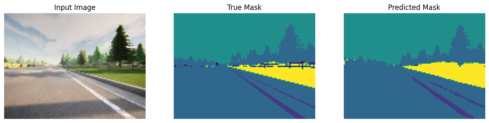
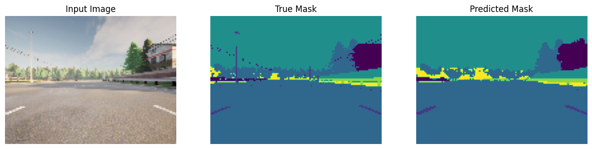
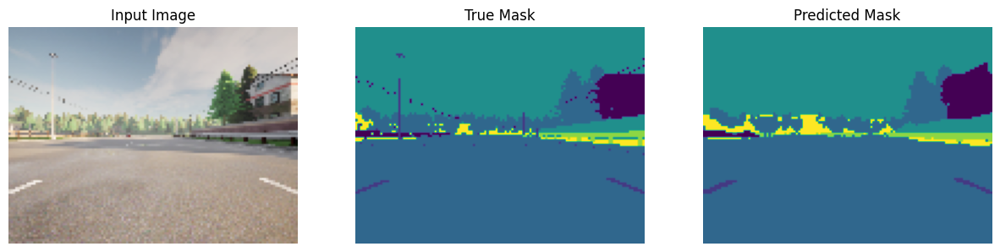
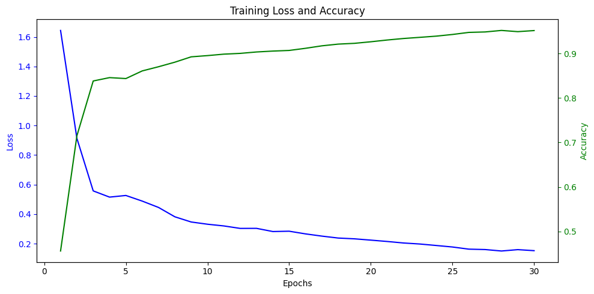

# 🚗 CARLA Road Segmentation with U-Net

This project implements a semantic segmentation pipeline using a custom-built **U-Net** architecture, trained on synthetic driving scenes from the **CARLA simulator**. The model learns to distinguish roads, sidewalks, and other driveable areas - pixel by pixel. A foundational step toward autonomous driving systems.

> This project implements a semantic segmentation pipeline using a U-Net architecture built entirely from scratch in TensorFlow/Keras (no pre-built blocks or model imports). The full encoder–decoder network, including skip connections, transposed convolutions, dropout, and modular blocks, was written manually with care to match U-Net's original structure

---

## 📁 Repository Structure

```bash
carla-road-segmentation-unet/
│
├── data/ # Dataset: RGB images and segmentation masks from CARLA
│ ├── CameraRGB/ # Input images (simulated car camera views)
│ └── CameraMask/ # Ground truth segmentation masks
│-- out_images/
├── images/ # Visual diagrams
│ ├── encoder.png # Encoder block overview
│ ├── decoder.png # Decoder block overview
│ ├── unet.png # Full U-Net architecture
│ └── carseg.png # Sample predictions
│
├── saved_model/
│ └── unet_model.h5 # Trained U-Net model
│
├── notebook.ipynb # Complete pipeline (training, evaluation, prediction)
└── README.md
```

---

## What’s Inside?

- **Data Preprocessing**: All CARLA `.png` images are resized, normalized, and loaded with `tf.data`.
- **U-Net Architecture**: Built from scratch with TensorFlow/Keras. Includes skip connections, max-pooling, dropout, and transposed convolutions.
- **Training**: Uses `SparseCategoricalCrossentropy` loss and tracks accuracy.
- **Evaluation**: Visualizes prediction vs ground truth for side-by-side comparison.
- **Model Saving**: Trained model is saved in `.h5` format for easy reuse or fine-tuning.

---

## My Custom U-Net Implementation

Instead of using a pre-made model or library like `segmentation_models`, this project builds the full U-Net architecture **from the ground up**, including:

- Custom convolutional blocks (encoder + decoder)
- Skip connections with `Concatenate`
- Upsampling via `Conv2DTranspose`
- Carefully handled dropout, padding, and initializer setup
- Shape tracking and manual tensor management

All blocks (`conv_block`, `upsampling_block`, etc.) were modularly built and composed into the full model using Keras Functional API.

> This gives maximum flexibility, learning experience, and full control over the design.

## Results

Here are some examples of the model's performance on the CARLA road scenes dataset.

<p align="center">
  
  <br/>
  
  <br/>
  
</p>

These visualizations clearly show that the model successfully captures road structure, lane boundaries, and segmentation class boundaries with high confidence.

---

### Loss and Accuracy Curve

<p align="center">
  
</p>

---

## How U-Net Works (Quick Summary)

- **Encoder**: Repeated Conv2D layers + MaxPooling shrink the image and extract features.
- **Decoder**: Upsamples the feature maps and concatenates with corresponding encoder layers (skip connections).
- **Output**: 1×1 Conv that outputs a class for each pixel in the image.

> U-Net is especially good for tasks where spatial details matter - like road segmentation in self-driving.

---

## 👨‍💻 Author

**Nabeel Shan**  
Software Engineering Student - NUST Islamabad  
Aspiring AI Researcher | AI/ML Enthusiast  
[LinkedIn](https://www.linkedin.com/in/nabeelshan) • [GitHub](https://github.com/nabeelshan78)  
- Currently focused on mastering CNNs, YOLO, and ResNet architectures.
- Mastering Deep Learning architectures through hands-on work
- Looking to collaborate on AI/ML projects or research opportunities

---

## ⭐ Star the Repo

If you found this helpful, please consider **starring** 🌟 the repository - it helps others discover this resource and motivates continued open-source contributions.

---
